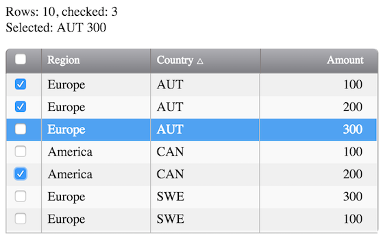

# Grid Component

[](https://gitter.im/icanjs/grid-component?utm_source=badge&utm_medium=badge&utm_campaign=pr-badge&utm_content=badge)

A template based grid component that supports sorting, row selection, paged rendering and checkboxes. Built with CanJS.



## Installation

```
npm install grid-component grid-filter --save
```

## Use

```html
<can-import from="grid-filter" />

<grid-component {(rows)}="items">

  <div class="grid-tools">
    <grid-filter {(rows)}="rows"></grid-filter>
  </div>

  <table>
    <thead>
      <tr>
        <th ($click)="{sortBy 'title'}">Title {{{sortArrow 'title'}}}</th>
        <th ($click)="{sortBy 'amount'}">Amount {{{sortArrow 'amount'}}}</th>
      </tr>
    </thead>

    <tbody>
      {{#each rows}}
        <tr class="{{#if isHidden}}hidden{{/if}}">
          <td>{{title}}</td>
          <td>{{amount}}</td>
        </tr>
      {{/each}}
    </tbody>
  </table>

</grid-component>
```